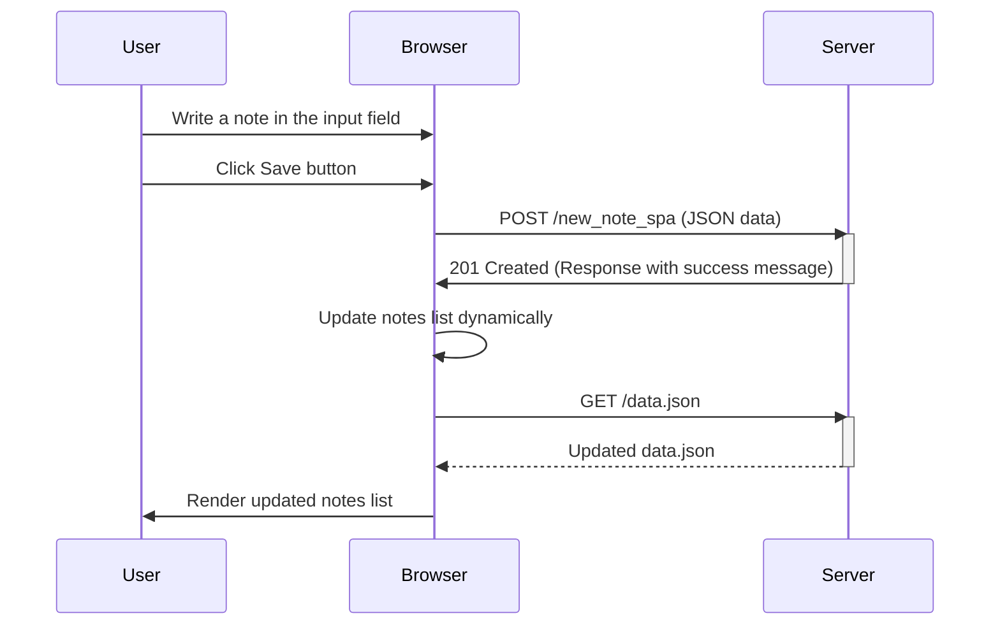

## 0.6 - new note single page app diagram

```mermaid
sequenceDiagram
    participant User
    participant Browser
    participant Server
    User->>Browser: Write a note in the input field
    User->>Browser: Click Save button
    Browser->>Server: POST /new_note_spa (JSON data)
    activate Server
    Server->>Browser: 201 Created (Response with success message)
    deactivate Server
    Browser->>Browser: Update notes list dynamically
    Browser->>Server: GET /data.json
    activate Server
    Server-->>Browser: Updated data.json
    deactivate Server
    Browser->>User: Render updated notes list

```