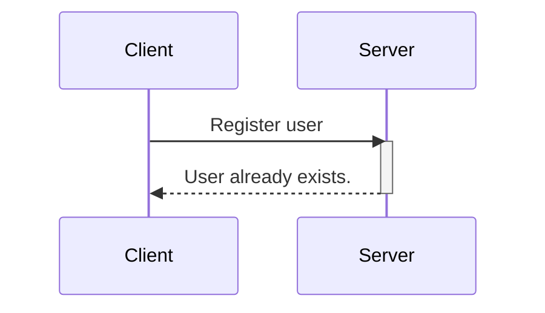

## Definition:
A sequence diagram is an illustrative representation of interactions between processes, demonstrating their operational flow and the sequence of execution.

You can render sequence diagrams in mermaid using this syntax:
```
sequenceDiagram
    participant Client
    participant Server
    Client->>Server: Register user
    activate Server
    Server-->>Client: User already exists.
    deactivate Server
```

## Result:


## Syntax breakdown:
* `sequenceDiagram`: This keyword specifies that we are making a sequence diagram.
* `participant`: These are the participants or the actors in a sequence diagram.
* `activate/ deactivate`: It is possible to activate and deactivate an actor. Activation shows as a small rectangle between interactions.
* `-->>`: Connecting lines (dashed).
* `->>`: Connecting lines (solid).

___

## How to create a sequence diagram:
Creating a sequence diagram involves several steps, and it’s typically done during the design phase of software development to illustrate how different components or objects interact over time. Here’s a step-by-step guide on how to create sequence diagrams:

### Step 1: Identify the Scenario:
Understand the specific scenario or use case that you want to represent in the sequence diagram. This could be a specific interaction between objects or the flow of messages in a particular process.

### Step 2: List the Participants:
Identify the participants (objects or actors) involved in the scenario. Participants can be users, systems, or external entities.

### Step 3: Define Lifelines:
Draw a vertical dashed line for each participant, representing the lifeline of each object over time. The lifeline represents the existence of an object during the interaction.

### Step 4: Arrange Lifelines:
Position the lifelines horizontally in the order of their involvement in the interaction. This helps in visualizing the flow of messages between participants.

### Step 5: Add Activation Bars:
For each message, draw an activation bar on the lifeline of the sending participant. The activation bar represents the duration of time during which the participant is actively processing the message.

### Step 6: Draw Messages:
Use arrows to represent messages between participants. Messages flow horizontally between lifelines, indicating the communication between objects. Different types of messages include synchronous (solid arrow), asynchronous (dashed arrow), and self-messages.

### Step 7: Include Return Messages:
If a participant sends a response message, draw a dashed arrow returning to the original sender to represent the return message.

### Step 8: Indicate Timing and Order:
Use numbers to indicate the order of messages in the sequence. You can also use vertical dashed lines to represent occurrences of events or the passage of time.

### Step 9: Include Conditions and Loops:
Use combined fragments to represent conditions (like if statements) and loops in the interaction. This adds complexity to the sequence diagram and helps in detailing the control flow.

### Step 10: Consider Parallel Execution:
If there are parallel activities happening, represent them by drawing parallel vertical dashed lines and placing the messages accordingly.

### Step 11: Review and Refine:
Review the sequence diagram for clarity and correctness. Ensure that it accurately represents the intended interaction. Refine as needed.

### Step 12: Add Annotations and Comments:
Include any additional information, annotations, or comments that provide context or clarification for elements in the diagram.

### Step 13: Document Assumptions and Constraints:
If there are any assumptions or constraints related to the interaction, document them alongside the diagram.

### Step 14: Tools:
Use a UML modeling tool or diagramming software to create a neat and professional-looking sequence diagram. These tools often provide features for easy editing, collaboration, and documentation.

___

Credits:
* [ [Freecodecamp: How to Create Diagrams as Code with Mermaid, GitHub, and Visual Studio Code](https://www.freecodecamp.org/news/diagrams-as-code-with-mermaid-github-and-vs-code/) ]
* [ [GeeksforGeeks: Sequence Diagrams – Unified Modeling Language (UML](https://www.geeksforgeeks.org/unified-modeling-language-uml-sequence-diagrams/) ] 